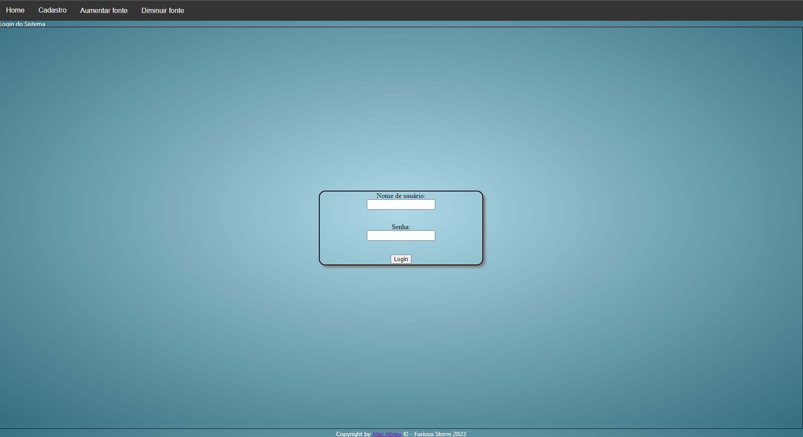
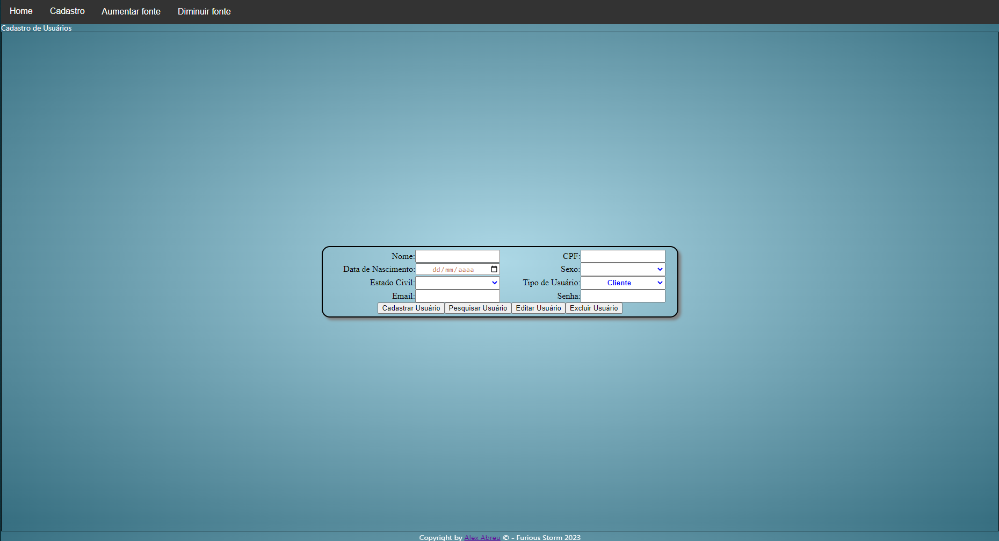

# Sistema de Cadastro de Currículos

Bem-vindo ao Sistema de Cadastro de Currículos! Este é um projeto desenvolvido em Html5, CSS3, Javascript e PHP com banco de dados SQLITE3 que permite o cadastro e gerenciamento de currículos. Com ele, você pode facilmente adicionar, editar e excluir informações de currículos em uma interface amigável e intuitiva.

O Sistema usa alguns recursos de API de Geolocalização do navegador para obter a latitude e longitude do usuário. Se a geolocalização estiver disponível, a função `showPosition` é chamada com a posição atual do usuário. Esta informação é útil para emissão de relatórios para diversos fins como ofícios e documentos além claro de estudar a aplicação!

O Sistema também conta com um código define uma função chamada `cadastroUsuario` que é responsável por lidar com o envio do formulário de cadastro de usuários. A função `cadastroUsuario` recebe como argumento uma referência ao elemento do formulário. Ela adiciona um ouvinte de evento para o envio do formulário e impede o comportamento padrão (recarregar a página). Em seguida, ela cria um objeto FormData a partir do formulário e valida os dados usando a função validateForm.

Se os dados forem válidos, a função cria um objeto XMLHttpRequest e abre uma conexão com o script PHP crud_usuario.php. Ela envia os dados do formulário para o script PHP e aguarda a resposta. Quando a solicitação for concluída, a função verifica se houve algum erro e, em caso afirmativo, exibe uma mensagem de erro. Caso contrário, ela processa a resposta do script PHP e exibe uma mensagem de sucesso. Além disso a função `formatCPF` é responsável por formatar um número de CPF, adicionando os pontos e o traço de formatação. 

A função `validateCPF` é responsável por validar um número de CPF, verificando se ele é válido de acordo com as regras do CPF. A função formatCPF recebe como argumento um número de CPF como uma string. Ela remove qualquer caractere não numérico da string usando uma expressão regular e, em seguida, adiciona os pontos e o traço de formatação usando o método replace. Por fim, ela retorna o CPF formatado.

A função validateCPF recebe como argumento um número de CPF como uma string. Ela remove qualquer caractere não numérico da string usando uma expressão regular e verifica se o CPF tem 11 dígitos. Em seguida, ela verifica se o CPF é uma sequência de dígitos repetidos (inválido) usando uma expressão regular.

Se o CPF passar nessas verificações iniciais, a função calcula o primeiro dígito verificador e verifica se ele é válido. Em seguida, ela calcula o segundo dígito verificador e verifica se ele é válido. Se ambos os dígitos verificadores forem válidos, a função retorna true, indicando que o CPF é válido. Caso contrário, ela retorna false.

Este sistema também conta com um método de ativação e autenticação de usuário através de login. Quando o formulário é enviado, ele impede o comportamento padrão (recarregar a página), cria um objeto `FormData` a partir do formulário e envia os dados para o script PHP `login.php` usando um objeto `XMLHttpRequest`.

Quando a solicitação for concluída, o código verifica se houve algum erro e, em caso afirmativo, exibe uma mensagem de erro. Caso contrário, ele processa a resposta do script PHP e verifica o tipo de usuário (userType) retornado pelo script. Se o userType for 0, o código redireciona o usuário para a página curriculo.php. Se o userType for 1, o código redireciona o usuário para a página admin.php.

Segue algumas capturas da tela do sistema desenvolvido:

